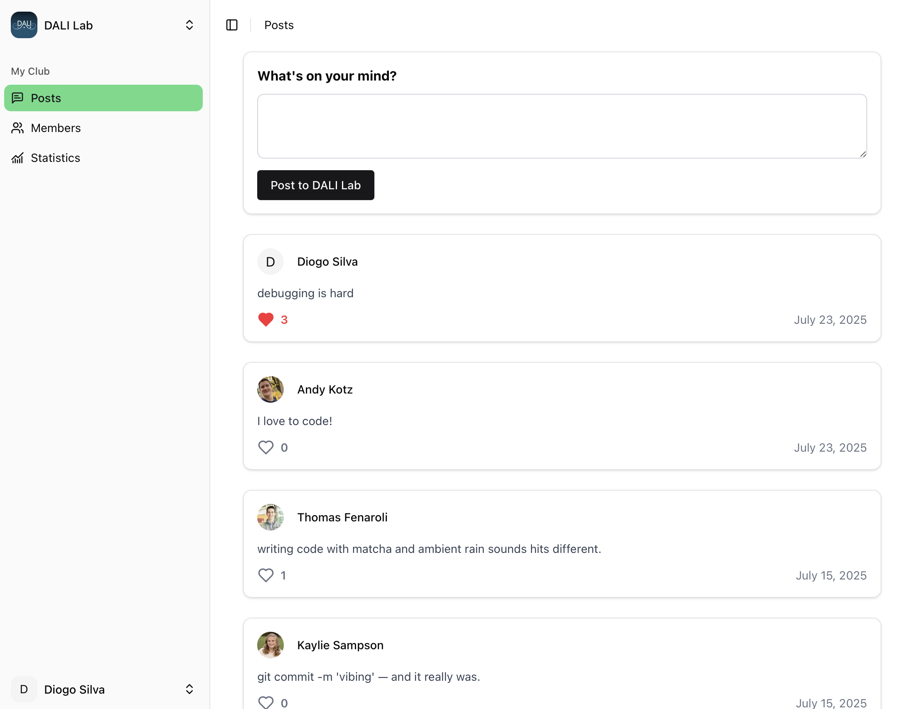
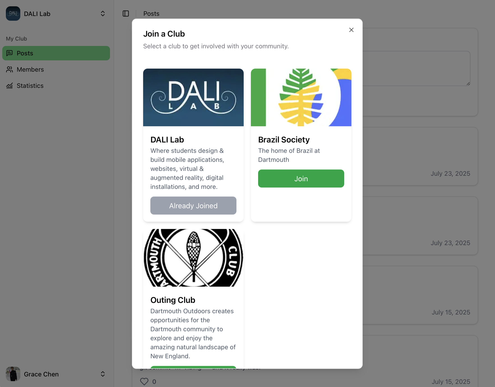
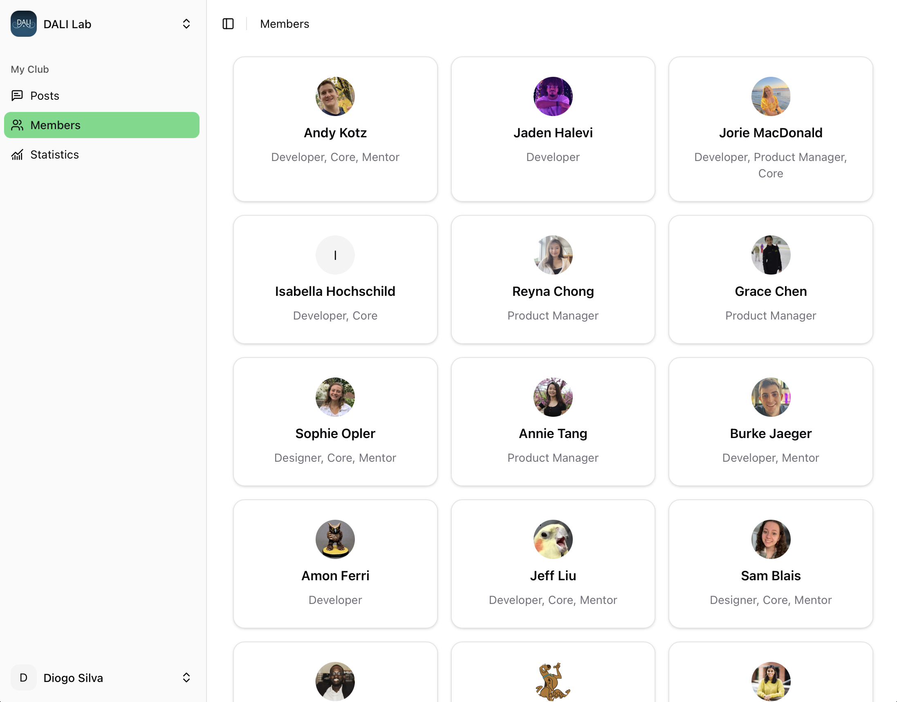
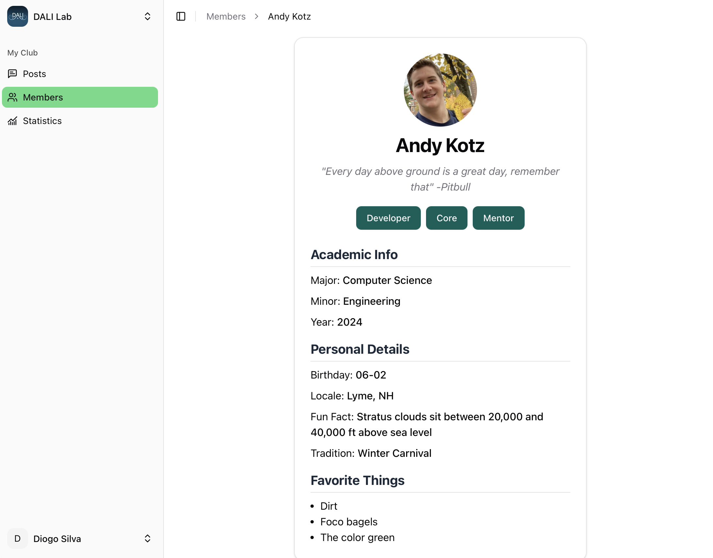
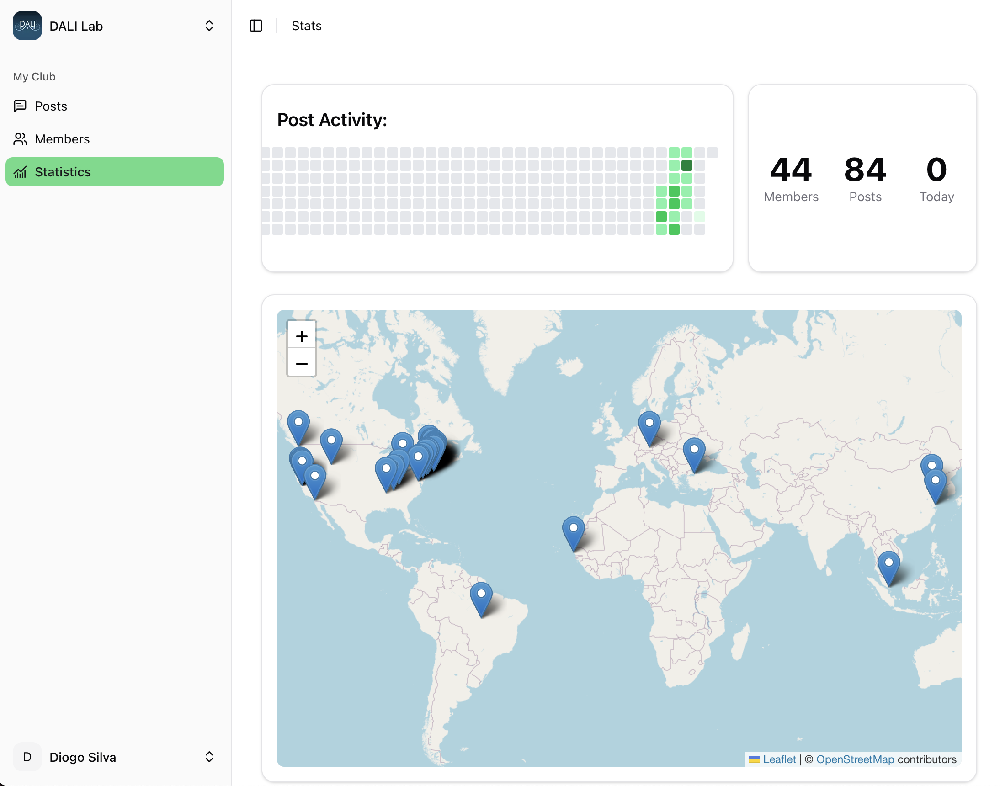
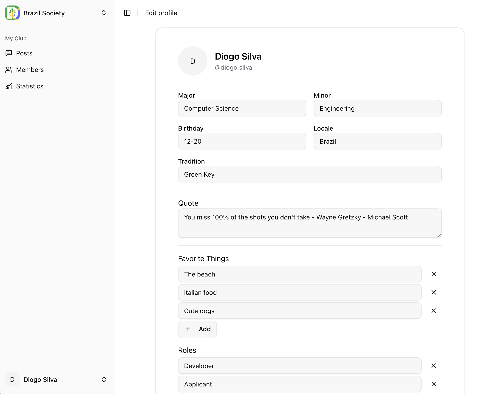

# dartnet
dartnet is a social platform built for members of the Dartmouth community to connect through
clubs, shared interests, and campus events. Users can join clubs, create and interact with
posts, view member profiles, and stay informed about club activities and statistics.

## [Deployed](https://dartnet.vercel.app/)
**[Visit the deployed instance of dartnet here.](https://dartnet.vercel.app/)**
> [!TIP]
> 
> Authentication is required as part of dartnet's design.
> You may log in with the example credentials: 
> 
> Username: `diogo.silva`
> 
> Password: `dartmouth`
> 
> Or, you may use the credentials of **any other registered user** specified
> [here](./prisma/profiles.seed.json) using `name.lastname` format, such as
> `andy.kotz` or `reyna.chong`. The password is always `dartmouth`.

## Screenshots
<table>
  <tr>
    <td style="padding: 10px; text-align: center;">
      <br/>
      <strong>Create and Like Posts</strong>
    </td>
    <td style="padding: 10px; text-align: center;">
      <br/>
      <strong>Join Clubs</strong>
    </td>
  </tr>
  <tr>
    <td style="padding: 10px; text-align: center;">
      <br/>
      <strong>Browse Members</strong>
    </td>
    <td style="padding: 10px; text-align: center;">
      <br/>
      <strong>View Profiles</strong>
    </td>
  </tr>
  <tr>
    <td style="padding: 10px; text-align: center;">
      <br/>
      <strong>Learn Club Stats</strong>
    </td>
    <td style="padding: 10px; text-align: center;">
      <br/>
      <strong>Manage your account</strong>
    </td>
  </tr>
</table>

## API Routes
Access to these API routes are protected by authentication. You can
explore them by signing-in on Web first, then either copying the session cookie into
curl or Postman, or by visiting the links from the browser.

| Path                              | Method    | Description                                                                 |
|-----------------------------------|-----------|-----------------------------------------------------------------------------|
| `/api/auth/[action]`              | GET, POST | Authentication-related routes (/signin, /signout, /callback) used by AuthJS |
| `/api/clubs/[id]/members`         | GET       | List club members                                                           |
| `/api/clubs/[id]/stats/activity`  | GET       | Stats about the club's most recent posts                                    |
| `/api/clubs/[id]/stats/count`     | GET       | Stats about the club's number of posts and users                            |
| `/api/clubs/[id]/stats/locations` | GET       | List of locations of club members                                           |
| `/api/clubs/join`                 | GET       | List of clubs a user is eligible to join                                    |
| `/api/clubs/join`                 | POST      | Adds a user to a club                                                       |
| `/api/clubs/list`                 | GET       | List of clubs the user is a member of                                       |
| `/api/posts`                      | GET       | Get a list of posts for a given club                                        |
| `/api/posts`                      | POST      | Create a new post                                                           |
| `/api/posts/like`                 | POST      | Like a post                                                                 |
| `/api/user`                       | GET       | Get details about a user by ID                                              |
| `/api/user`                       | PATCH     | Update a user's information                                                 |


## Running Locally

First, clone the repository locally and install the necessary node modules
by running `npm install`.

Then, copy the `.env.example` file to `.env`, then specify a DB
connection string using the Prisma ORM format. More information is
available [on Prisma's website.](https://pris.ly/d/connection-strings) It is also 
necessary to generate a random seed `AUTH_SECRET=` for use with the JWT provider.
This can be generated by running `npx auth secret`.

Next, reset the development DB, run the necessary migrations, and seed the example users:
```bash
npx prisma migrate reset
npx prisma generate --no-engine
npx prisma db seed
```

Finally, run the development server:
```bash
npm run dev
```

Open [http://localhost:3000](http://localhost:3000) with your browser to see the result.


## Learning Journey

**What inspired you to create this project?**  
I wanted to build a realistic full-stack app to practice authentication, data relationships, and UI design.
Based off the [Social Media Challenge](https://dalilab.notion.site/Social-Media-Challenge-72a37c4d33d44de194e66253e7efe7a0),
I decided to expand the scope to be focused on various club experiences,
providing a platform for users to plan events and share information with their community. 

**What potential impact do you believe it could have on its intended users or the broader community?**  
The app would allow Dartmouth students explore clubs, find peers with shared interests, and engage in campus activities.
Right now a lot of information is spread out between the rarely-used Dartmouth Groups website, and various GroupMe chats,
and centralizing all of this in one place would be a nice benefit.

**What new technology did you learn?**  
While I was already comfortable with Next.js, this project introduced me to several new tools:
Prisma ORM for database management, AuthJS for handling authentication flows, Leaflet for rendering interactive maps,
and Openstreetmap's Nominatim for geocoding. Using these tools together gave me a better understanding of
backend/frontend integration, especially with typesafe queries.

**Why did you choose the new technology?**  
Prisma was chosen for its type safety and seamless integration with TypeScript. AuthJS offered flexibility and simplicity in setting up custom authentication, including support for credentials. Leaflet and nominatim were lightweight, open-source options that fit the mapping features I wanted to build without adding unnecessary complexity. I also used ShadCN and TailwindCSS to quickly style the app while maintaining a consistent, clean design system.

**What challenges did you face, and what did you learn from the experience?**  
One of the things I wanted to do for this project was incorporate a "Sign in with Dartmouth" option. Unfortunately,
access to the necessary API wasn't available, so I had to pivot and implement my own custom auth flow using AuthJS.
This ended up being a valuable learning experience, learning about how credential providers work, 
as well as seeding users.
